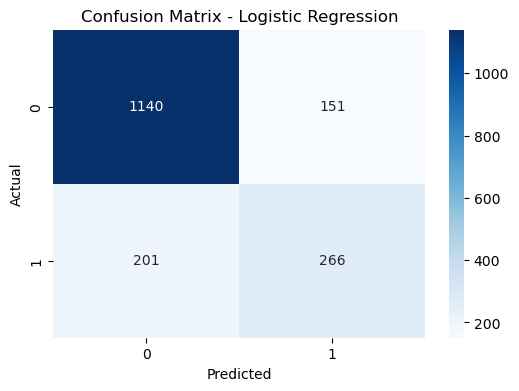
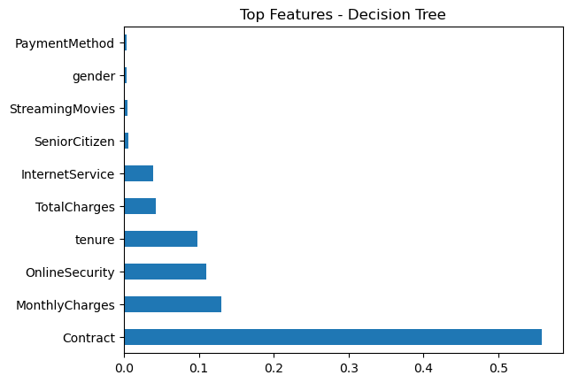
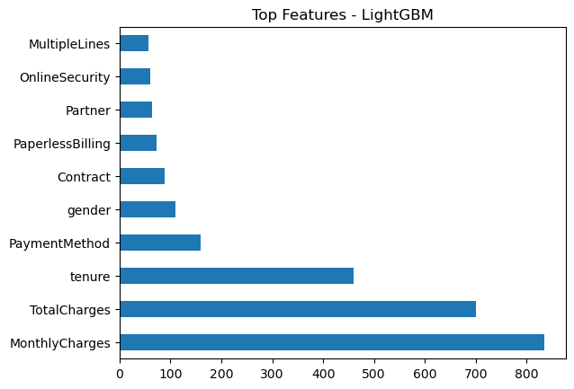

# 🧠 Customer Churn Prediction - Telecom Industry

An end-to-end machine learning project to predict customer churn in a telecom company. The goal is to identify customers likely to churn, understand the key factors behind it, and support retention strategies through actionable insights and visualizations.

---

## 📊 Business Context

Customer churn significantly impacts revenue and operational efficiency in subscription-based businesses. By leveraging historical customer data, this project aims to:

- Predict the likelihood of churn
- Identify key factors influencing customer retention
- Empower stakeholders with interpretability and KPIs

---

## ✅ Key Highlights

- 📁 Real-world dataset of 7,043 customers from a telecom provider  
- 🔍 Full data cleaning: type conversions, missing value handling  
- 🧹 Feature engineering: label encoding, scaling, class balancing  
- 🤖 ML models: Logistic Regression, Decision Tree, LightGBM  
- 📉 Performance metrics: Accuracy, Precision, Recall, F1  
- 🔥 Feature importance analysis to support business decisions  
- 📷 Visualizations: Confusion Matrix, Churn Drivers  
- 💬 Clear model comparison to recommend best-performing strategy

---

## 🛠️ Tools & Technologies

| Tool | Purpose |
|------|---------|
| **Python (Pandas, NumPy)** | Data analysis and preprocessing |
| **Matplotlib / Seaborn** | Exploratory and model visuals |
| **Scikit-learn** | ML modeling and evaluation |
| **LightGBM** | Gradient boosting classifier |
| **Jupyter Notebook** | Development and visualization |
| *(Optional)* Power BI | Dashboard for business users |

---

## 📁 Project Structure

customer-churn-prediction-ml/
├── Dataset
├── Churn_Prediction.ipynb
├── images/ # Visuals used in README
├── requirements.txt
└── README.md


---

## 📈 Results

| Model               | Accuracy | Precision | Recall | F1-Score |
|--------------------|----------|-----------|--------|----------|
| Logistic Regression| 0.80     | 0.72      | 0.65   | 0.68     |
| Decision Tree      | 0.78     | 0.70      | 0.68   | 0.69     |
| LightGBM           | **0.82** | **0.75**  | **0.70**| **0.72** |

> 📌 LightGBM delivered the best overall performance.

---

## 📊 Visual Snapshots

### 🔹 Confusion Matrix


### 🔹 Feature Importance-Decision Tree


## 🔹 Feature Importance-LightGBM


---

## 🧠 Key Insights

- **Tenure**, **MonthlyCharges**, and **Contract Type** are strong churn predictors.
- Short-tenure, month-to-month contract customers are most likely to churn.
- Gender and SeniorCitizen had low predictive power.

---

## 🚀 Future Enhancements

- Hyperparameter tuning using `GridSearchCV`
- Handling class imbalance using SMOTE
- Power BI dashboard for stakeholder-facing visualization
- Model deployment with Flask or Streamlit (optional)

---

## 📌 How to Run

```bash
pip install -r requirements.txt
jupyter notebook notebook/Churn_Prediction.ipynb
